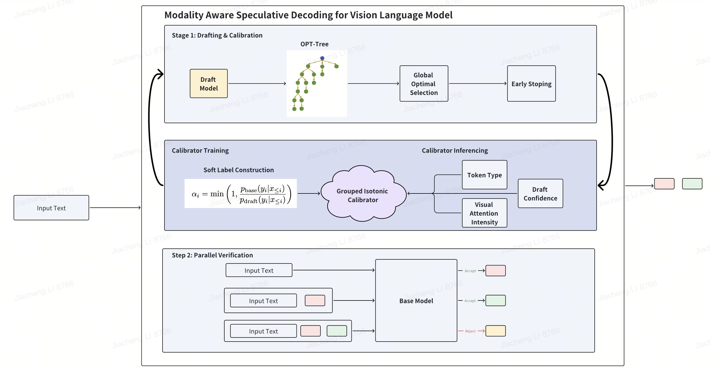
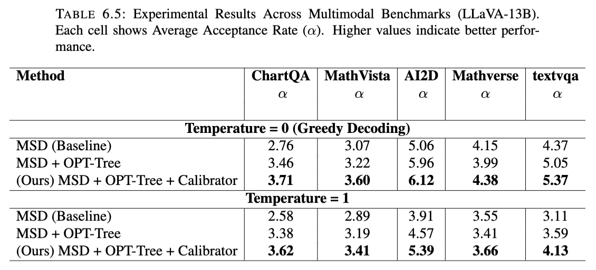
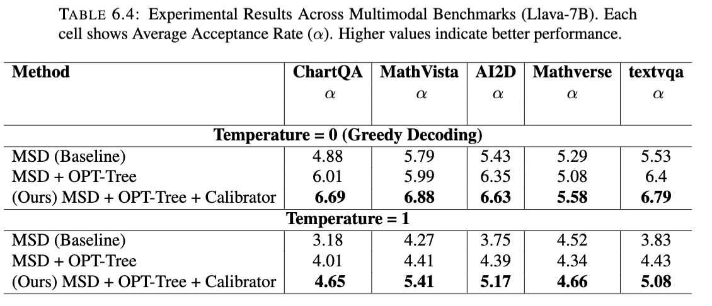

# Modality Aware Speculative Decoding For Vision Language Model

## Overall Architecture



In the drafting stage, we make two key improvements. We use an OPT-Tree structure to overcome the local optimal problem, and use Early Stopping mechanism to avoid low-probability branches.

The core of our contribution is the synergy between drafting and calibration. In the training phase, we use the acceptance rate formula to construct a soft label, training our calibrator to predict a token's acceptance rate. Then, during inference, it uses the token's type, visual attention, and draft confidence to generate an acceptance rate.

Crucially, this predicted acceptance rate is then used to guide the construction of the OPT-Tree. This ensures our draft tree is built based on a more accurate measure of a token's utility.

## Results





## Contributions

To summarise, this thesis presents a framework for speculative decoding in Vision-Language Models, centered around the contributions below:

- We introduced a grouped isotonic calibrator that conditions on token type and visual attention intensity to correct confidence miscalibration, and we use the token-level acceptance rate to directly optimize draft tree construction.
- We integrate the OPT-Tree and Early Stop to improve existing limitations while maintaining the lossless property.

Taken together, these contributions establish a robust and effective method for accelerating inference in large Vision-Language Models.

## 🧠 MSD draft Models

Our Modality Aware Speculative Decoding is built on top of MSD; the draft models we use can be found here:

- **MSD-LLaVA1.5-7B**: [lucylyn/MSD-LLaVA1.5-7B](https://huggingface.co/lucylyn/MSD-LLaVA1.5-7B)
- **MSD-LLaVA1.5-13B**: [lucylyn/MSD-LLaVA1.5-13B](https://huggingface.co/lucylyn/MSD-LLaVA1.5-13B)

---

## 🧱 1. Setup & Installation

```bash
conda create -n msd python=3.10 -y
conda activate msd
# Ensure CUDA 12.1 is installed and configured

cd LLaVA
pip install -e .
cd ../EAGLE
pip install -e .
cd ../lmms-eval
pip install -e .
```

---

## 📊 2. Evaluate the Model

Run evaluation with `lmms-eval`. The following example evaluates on the `ChartQA` task:

```bash
CUDA_VISIBLE_DEVICES=0 accelerate launch --num_processes=1 --main_process_port=29506 -m lmms_eval \
    --model <model_name> \
    --model_args pretrained="<base_model_path>" \
    --msd_model_path <msd_model_path> \
    --tasks chartqa \
    --batch_size 1 \
    --gen_kwargs temperature=0,train_ratio=0.2 \
    --use_msd \
```

**Parameters:**

- `<model_name>`: short name identifier of your model, e.g., `llava_msd_calibrated`
- `<base_model_path>`: path to the base pretrained model
- `<msd_model_path>`: path to the MSD model
---
